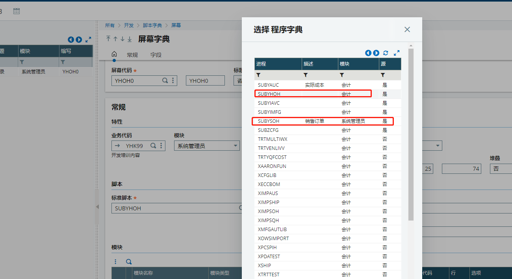

### 单据制作流程

1. 业务代码 ：YHK99

2. 数据字典表 ：YSORDER

3. 屏幕：YSOH0

   模块怎么使用 ？

   主表订单号录入？记录值自动生成？

   生成的程序字典模块为什么是会计？

   

4. 窗体：YSOH

   窗体建好后怎么自动生成功能？

5. 脚本字典（数据对象）：YSOH

6. 功能：GESYSOH

### eclipse安装x3插件

x3控件地址：http://pluginx3.sage.fr/safex3/studio/updates/

