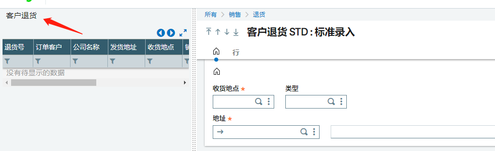
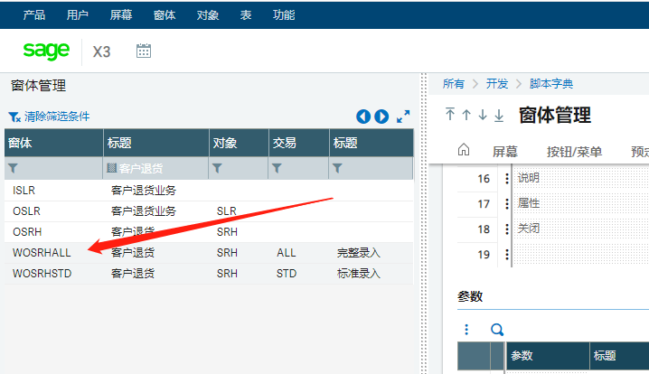
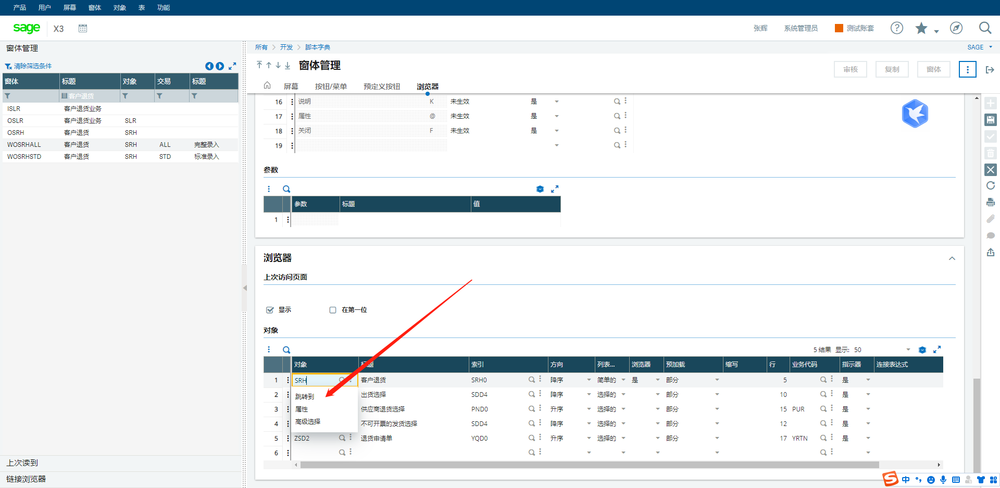
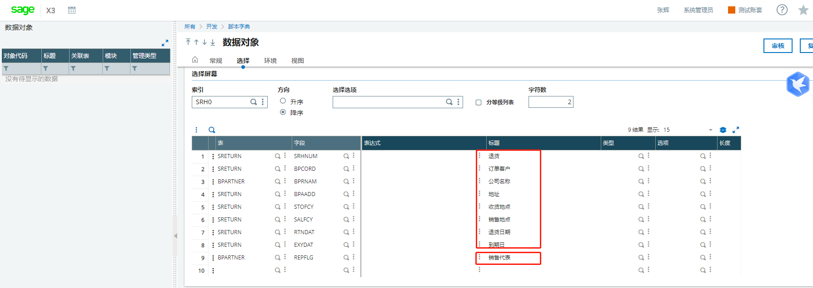
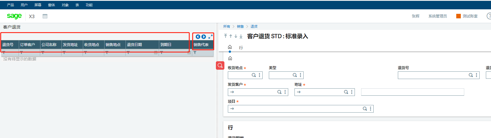
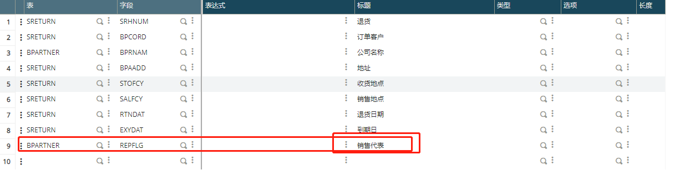
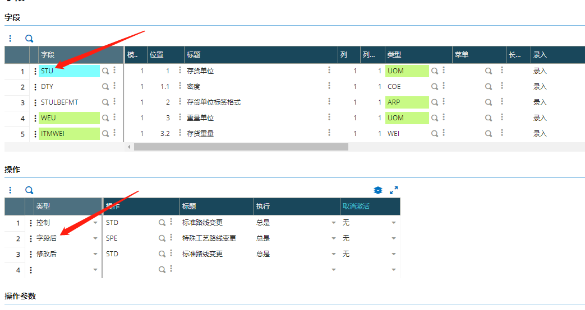
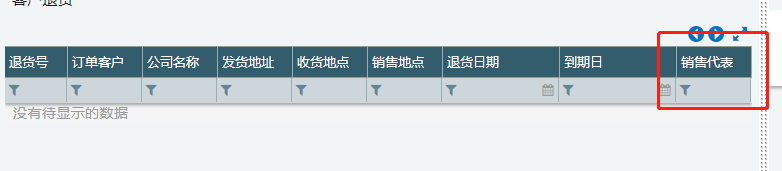

### **客户退货左侧列表增加业务员名字**

#### **用到的知识点**

- 窗体

- 对象

#### 需求列表

1. 销售->退货。左侧菜单栏增加一列销售员列

#### 开发过程：

进入客户退货页面

在窗体中找“客户退货”，因为退货界面窗体的名称就是“客户退货”

找到适用的窗体

进入窗体后选择‘’客户退货‘’对象，并跳转

在这能看到对象中的信息与客户退货页面的信息一致

在对象中根据表信息找到合适的数据字段

#### 实现效果

