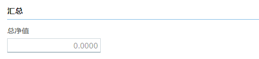
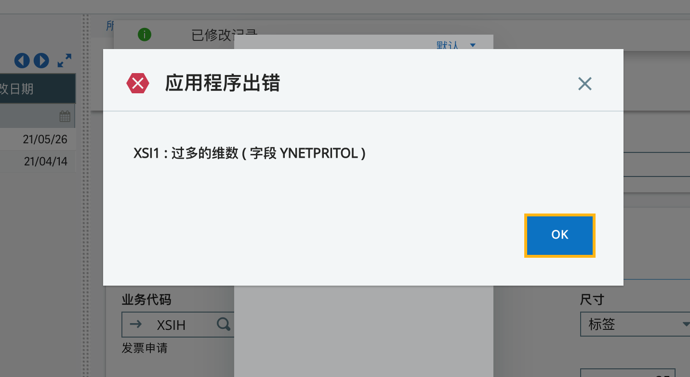
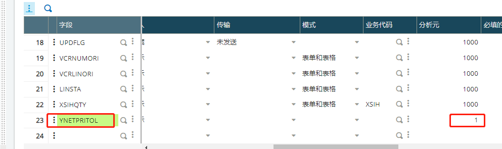

### 发票申请增加净值汇总

#### 需求列表

1. 销售发票申请增加净值汇总

#### 开发过程

1. 找到屏幕

2. 增加模块

   模块用列展示

   

3. 增加字段

   指定对应的模块，并且分析元填1，因为这个字段只需要一个文本框，如果你填10，就会出现10个文本框

4. 增加字段事件

5. 编写事件代码

   ```
   Subprog AV_YNETPRITOL(VALEUR)
   Variable Decimal VALEUR
   VALEUR = SUM([M:XSI1]NETPRILIN)
   End
   ```

#### 遇到问题

**这里就是因为分析元超出的问题，一开始我填写的是1000**






