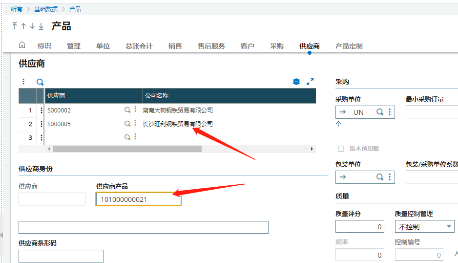

#### **用到的知识点**

- num$([M:ITM3]PUU)    打印非文字和数字类型时，可以用"**num$(**参数**)**"打印

- Affzo [M:ITM3]PUU      Affzo 刷新字段

- Subprog AV_XXXX(VALEUR)    

  ​	AV  代表字段后 

- Subprog AP_XXXX(VALEUR)     

  ​	AP  代表字段后 

  ​    xxxx就是你要操作的字段

  ​	可以不用自己编写，增加操作之后，保存、审核。能自动生成

  


#### 需求列表

1. 产品->供应商。新增供应商，下面的供应商产品默认为当前页产品

1. 找到“供应商”的屏幕(**ITP**)

2. 查看供应商的字段**BPSNUM**，和供应商产品字段**XITMREFBPS**

3. 在屏幕->供应商字段上加字段后操作

4. 在屏幕->供应商产品字段上加字段前操作

5.  

6. 编写代码

   ```
   ######################################################################################
   ## 由系统管理员添加的标签 (屏幕 ITP) 2021/06/29 14:30:49 (00198)
   ######################################################################################
   $ACTION
   Case ACTION
     When Default
   Endcase
   
   ######################################################################################
   ## 由系统管理员添加的标签 (屏幕 ITP) 2021/06/29 14:34:17 (00198)
   ######################################################################################
   Subprog AP_BPSNUM(VALEUR)
   [M:ITP]XITMREFBPS=[M:ITM0]ITMREF
   End
   
   ######################################################################################
   Subprog AV_XITMREFBPS(VALEUR)
   Variable Char    VALEUR()
   #Affzo [M:ITP]XITMREFBPS
   
   IF [M:ITP]XITMREFBPS = ''
       VALEUR = [M:ITM0]ITMREF
   ENDIF
   End
   ######################################################################################
   
   ```

   

   #### 实现效果

   

