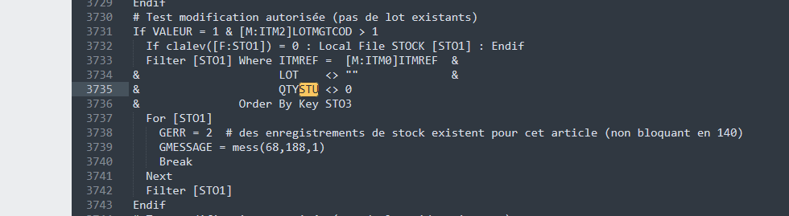
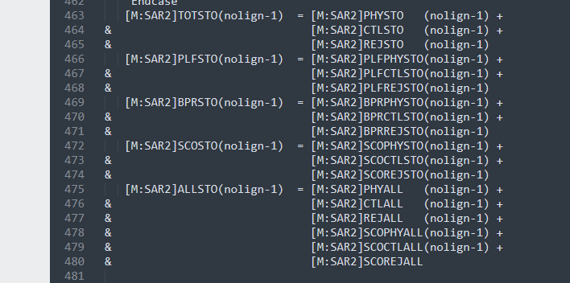

### 采购请求增加实际库存字段

#### 需求列表

1. 采购请求增加实际库存字段

#### 开发过程

1. 找到采购请求明细的屏幕

   **找屏幕的时候最好不要用屏幕缩写，因为缩写可以重复，可能搞错屏幕**

   有个地方需要注意，如果屏幕缩写和屏幕全称看起来没有什么关系，那么这个屏幕应该是子屏幕，虽然修改子屏幕会看到效果，但是子屏幕会遵循继承主屏幕的原则，只要审核交易，在子屏幕加的自定义字段会丢失。所以正常的开发逻辑应该是在母屏幕改（根据缩写找到母屏幕），改完审核交易，（交易菜单查询录入交易）

2. 添加实际库存字段

   借鉴其他库存字段，确定一些字段类型，命名什么的

3. 字段增加字段前事件

   字段前

4. 编写事件代码

   这部分的代码来源于两部分

   第一部分：产品页面如果产品有库存不能修改单位，推测判断了库存，从源码找到以下代码

   

   第二部分：存货功能模块有查询库存的功能，看看具体取哪些字段，发现屏幕字段并非直接对应的表字段，并且也不是用的STOCK表，而是ITMMVT,根据屏幕上的字段找到计算部分的代码，**得到库存计算的依据**

   

   ```
   Subprog AV_YQTYSTO(VALEUR)
   Variable Decimal VALEUR
   Local Decimal QTY
   
   If clalev([F:ITV]) = 0 : Local File ITMMVT [ITV] : Endif
   Filter [ITV] Where ITMREF = [M:PSH1]ITMREF(NOLIGN-1) & STOFCY = [M:PSH0]PSHFCY
   For [ITV]
     QTY += PHYSTO + CTLSTO + REJSTO - PHYALL - CTLALL - REJALL - SCOPHYALL - SCOCTLALL - SCOREJALL
     Break
   Next
   
   VALEUR = QTY
   
   End
   ```

   

#### 遇到的问题

当屏幕字段类型为MD8或者QTY的时候，发现字段值为0，不显示，目前系统其它地方也有这个问题