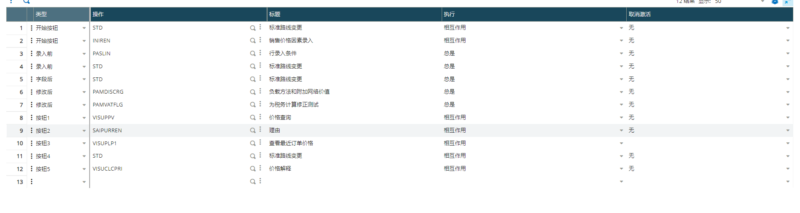

### 采购收货通过录入含税单价计算其他金额

#### 需求列表

1. 当前功能是通过输入毛价，得到其他价格，但是采购部全部是含税单价，需要用计算一边才能录入，效率低下，需要改成直接输入含税单价录入

#### 开发过程

1. 查看屏幕，发现是子屏幕

2. 找到母屏幕

3. 找到对应的表字典，增加含税单价字段（实际上也可以不加，只录入的时候来计算价格，不做持久化存储，因为采购收货的价格都是按照净价流转的），新增表字段，先找启封确认

4. 增加屏幕字段

5. 增加屏幕事件

6. 找计算净价的系统方法，通过采购请求的代码找到``` Call CLCTAXEPRI2(ZPOHPRI,ZVAT,2,GSOCIETE,[M:PTH0]RCPDAT,1,ZCLCAMT,ZPOHPRI) From TRTX3 ```

7. 编写代码

   ```
   Subprog AM_ZPOATIPRI(VALEUR)
   Variable Decimal VALEUR
   
   Local Decimal ZPOHPRI
   Local Char ZVAT(5)(0..2)
   Local Decimal ZCLCAMT(1..7)
   ZVAT(0)=[M:PTH1]VAT1(nolign-1)
   ZVAT(1)=[M:PTH1]VAT2(nolign-1)
   ZVAT(2)=[M:PTH1]VAT3(nolign-1)
   
   ZPOHPRI=VALEUR
   
   Call CLCTAXEPRI2(ZPOHPRI,ZVAT,2,GSOCIETE,[M:PTH0]RCPDAT,1,ZCLCAMT,ZPOHPRI) From TRTX3
   
   [M:PTH1]GROPRI(nolign-1)=ZPOHPRI
   Affzo [M:PTH1]GROPRI(nolign-1)
   
   [M:PTH1]NETPRI(nolign-1)=ZPOHPRI
   Affzo [M:PTH1]NETPRI(nolign-1)
   
   [M:PTH1]LINAMT(nolign-1)=ZPOHPRI*QTYUOM
   Affzo [M:PTH1]LINAMT(nolign-1)
   End
   ```

8. 审核交易

#### 遇到问题

一开始观察到输入毛价，净价，和行金额都会实时计算，但是这边通过屏幕字段修改刷新毛价后，按tab键毛价净价却不会重新计算，然后就一直找这个字段的事件



想手动触发一下，或者看一下源码的修改逻辑，但是事件太多，而且还都是官方代码

换种思路，直接把所有要计算的字段，在字段前事件里全部干预进去，测试发现效果一样
