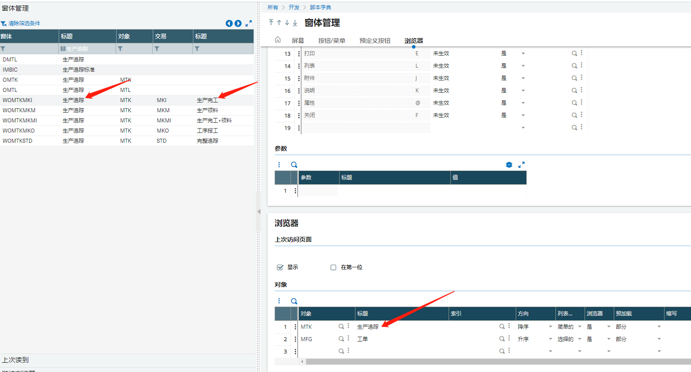
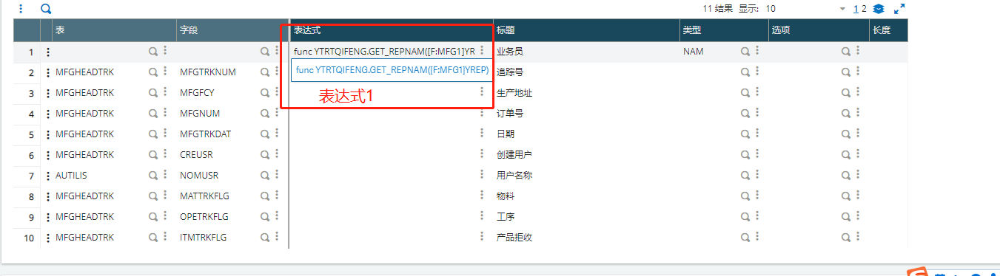
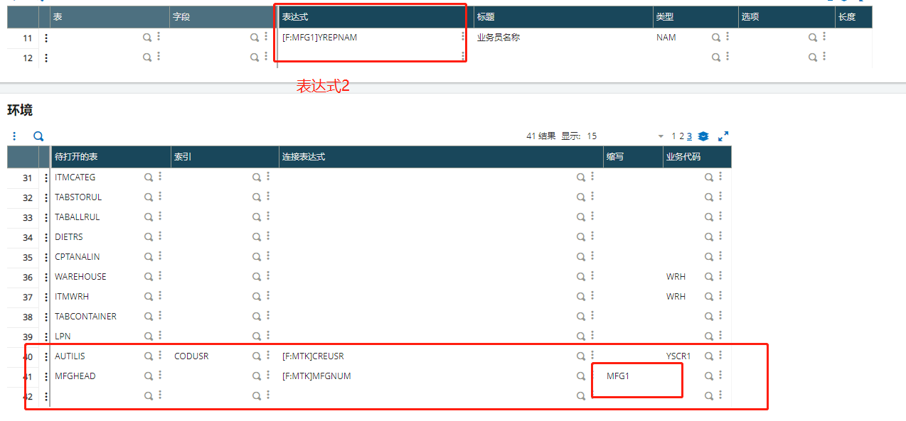
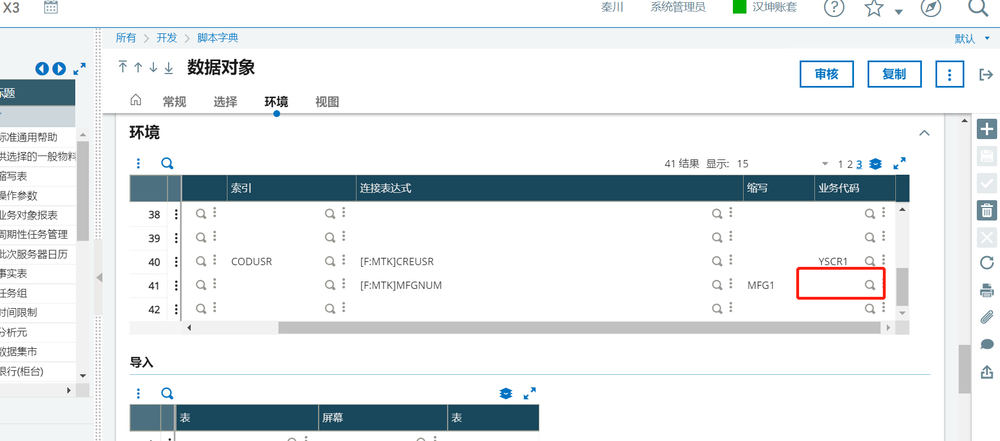

### 生产完工左列表可筛选业务员名称*

#### 需求列表

1. 生产完工左列表可筛选业务员名称

#### 开发过程：

1. 生产->生产追踪->生产完工				左列表可筛选业务员名称

2. 找到窗体和对象

3. 

4. 进入生产追踪对象

5. 在环境中 重新打开MFGHWAD表   由于系统之前打开过，无法打开，所以要在待打开表里重新添加MFGHEAD表 并重命名为MFG1，然后在表字段中使用表达式添加业务员名称，有两种表达式，

6. 

7. 

   8. 待打开的表要写业务代码。不写业务代码，下次更新会被覆盖
   9. 
   10. 

   ```
   
   ```


