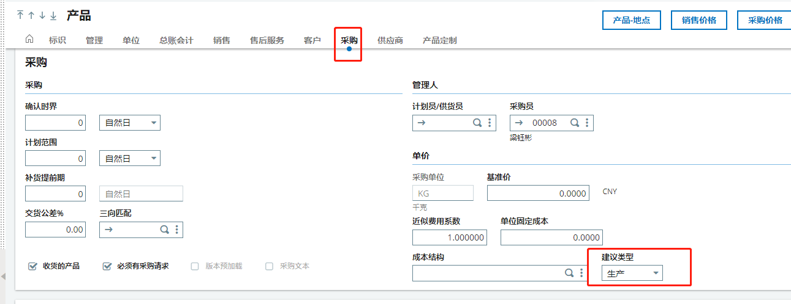
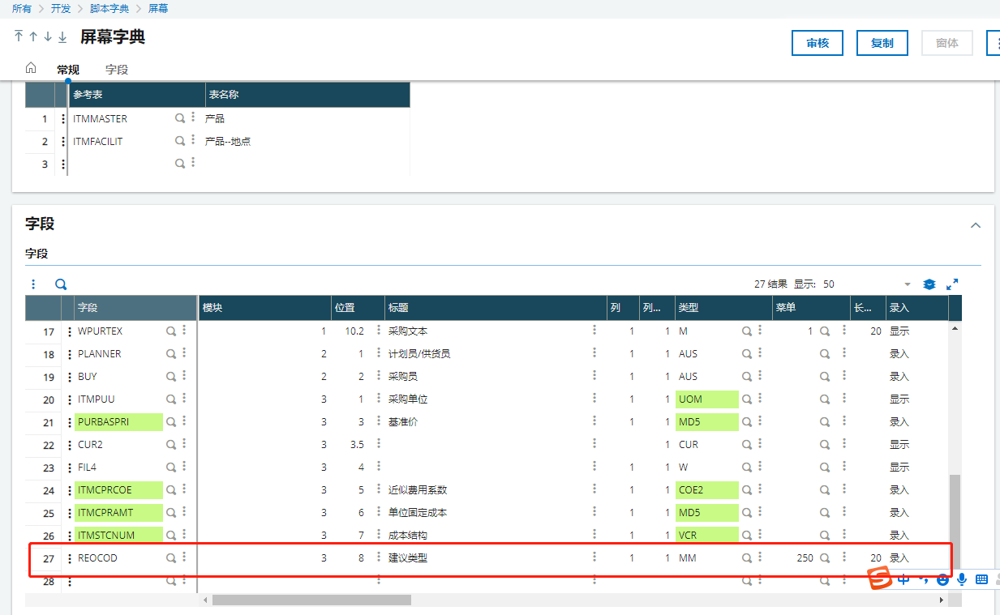
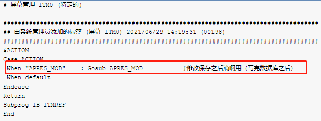
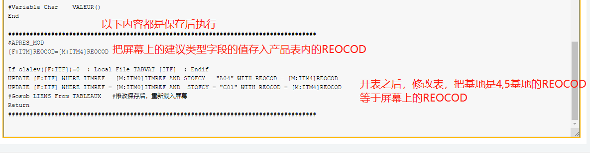

### 在产品主页定个建议类型，同时同步到四基地五基地的建议类型去

#### 需求列表

1. 在产品主页定个建议类型，同时同步到四基地五基地的建议类型去

#### 开发过程

1. 找到屏幕，增加字段

2. 

3. 

4. 在特殊脚本中增加修改保存后事件

5. 

6. 

7. 增加保存后事件代码

   

   ```
   $APRES_MOD
   [F:ITM]REOCOD=[M:ITM4]REOCOD
   
   If clalev([F:ITF])=0  : Local File TABVAT [ITF]  : Endif
   UPDATE [F:ITF] WHERE ITMREF = [M:ITM0]ITMREF AND STOFCY = "A04" WITH REOCOD = [M:ITM4]REOCOD
   UPDATE [F:ITF] WHERE ITMREF = [M:ITM0]ITMREF AND  STOFCY = "C01" WITH REOCOD = [M:ITM4]REOCOD
   #Gosub LIENS From TABLEAUX   #修改保存后，重新载入屏幕
   Return
   ```

   

#### 遇到的问题

1、为什么是在录入点内添加代码

2、为什么是在YENP录入点有待商榷