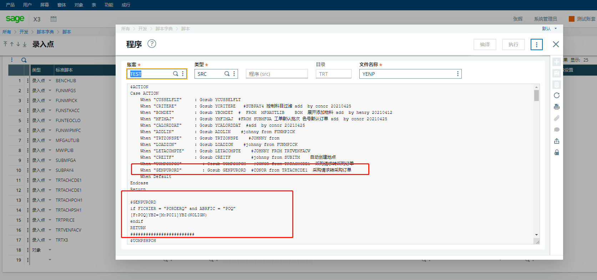

### 采购请求备注带到采购订单（采购）

#### 需求列表

1. 采购请求备注带到采购订单（采购）

#### 开发过程

1. 开发-》录入点

2. 

   ```
   $ACTION
   Case ACTION
       When "CUSSELFLT"     : Gosub YCUSSELFLT
       When "CRITERE"       : Gosub YCRITERE   #SUBPAY4 控制科目过滤 add  by conor 20210425
       When "BOMDET"        : Gosub YBOMDET  #  FROM  MFGAUTLIB    BOM  展开添加物料 add  by henry 20210412
       When "MFIMAJ"        : Gosub YMFIMAJ  #FROM SUBMFGA 工单默认批次 色号默认订单 add  by conor 20210425
       When "CALORDDAT"     : Gosub YCALORDDAT  #add  by conor 20210425
       When "ADDLIN"        : Gosub ADDLIN    #johnny from FUNMPICK
       When "TRTZONSPE"     : Gosub TRTZONSPE    #JOHNNY from
       When "LOADZON"       : Gosub LOADZON    #johnny from FUNMPICK
       When "LETACOMPTE"    : Gosub LETACOMPTE    #JOHNNY FROM TRTVENFACV
       When "CREITF"        : Gosub CREITF        #johnny from SUBITM    自动创建地点
       When "UOMPSHPOH"        : Gosub UOMPSHPOH   #CONOR from TRTACHCDE1  采购请求转采购订单
       When "GENPURORD"        : Gosub GENPURORD  #CONOR from TRTACHCDE1  采购请求转采购订单
       When Default
   Endcase
   Return
   
   $GENPURORD  
   if FICHIER = "PORDERQ" and ABRFIC = "POQ"
   [F:POQ]YBZ=[M:POI1]YBZ(NOLIGN)
   endif
   RETURN
   ```

   

#### 遇到的问题

1、为什么是在录入点内添加代码

2、为什么是在YENP录入点有待商榷