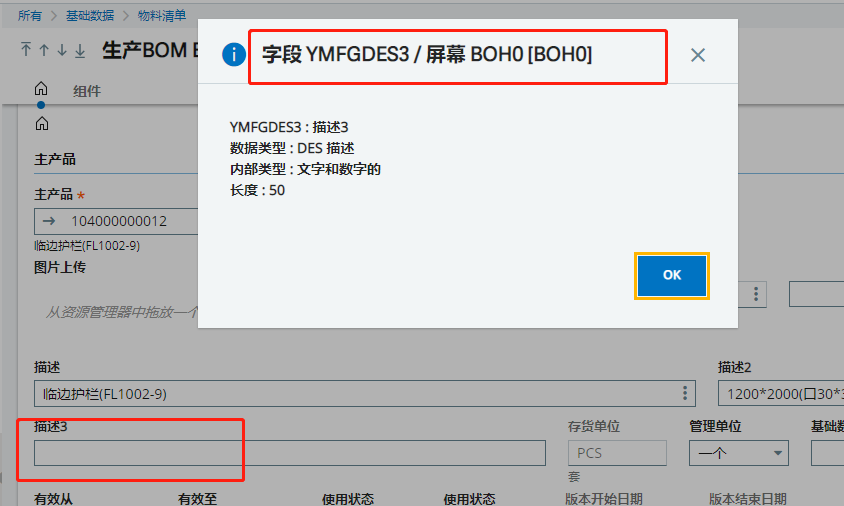
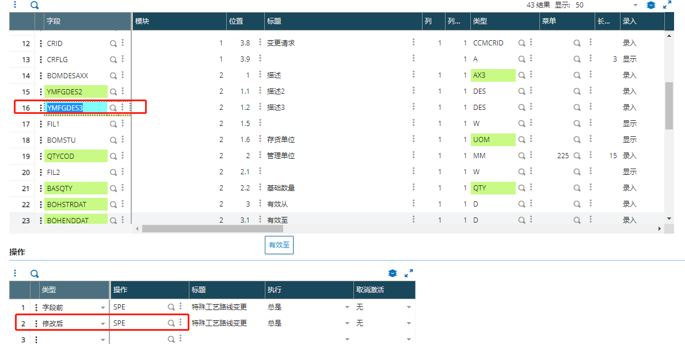
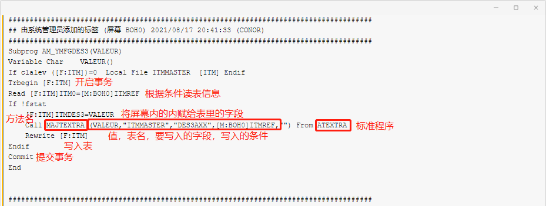

### **修改生产BOM描述3之后产品的描述3实时更新**

#### 需求列表

1. 修改描述3之后产品的描述3实时更新

   

   

#### 开发过程：

1. 找到生产BOIM的屏幕

   

2. 增加字段修改后事件

   

3. 编写代码

   

   ```
   Subprog AM_YMFGDES3(VALEUR)
   Variable Char    VALEUR()
   If clalev ([F:ITM])=0  Local File ITMMASTER  [ITM] Endif
   Trbegin [F:ITM]
   Read [F:ITM]ITM0=[M:BOH0]ITMREF
   If !fstat
       [F:ITM]ITMDES3=VALEUR
       Call MAJTEXTRA (VALEUR,"ITMMASTER","DES3AXX",[M:BOH0]ITMREF,"") From ATEXTRA
       Rewrite [F:ITM]
   Endif
   Commit
   End
   ```


