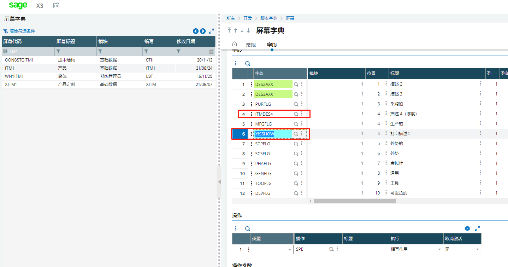
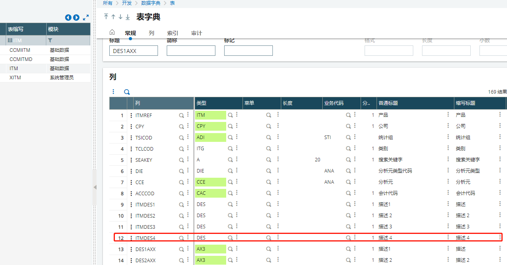
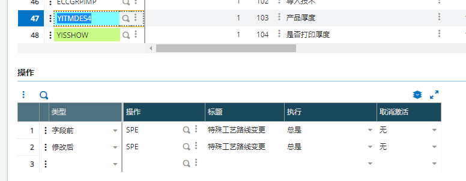
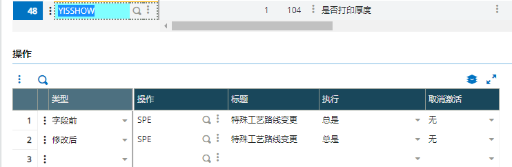

### **产品增加厚度和是否打印字段，在生产BOM展示，能双向互改更新**

#### 需求列表

1. 产品页增加厚度，是否打印字段


2.生产BOM行内增加厚度，是否打印列


3.能实现双向修改

#### 开发过程：

1. 产品屏幕增加字段

   

2.产品表增加字段ITMDES4、YISSHOW（增加完成之后能实现产品页描述4、是否显示的描述4的修改保存）



3.生产BOM屏幕内增加字段


给字段都增加操作





4.编写代码

```
######################################################################################
## 由系统管理员添加的标签 (屏幕 BOD1) 2021/08/24 17:47:58 (00198)
######################################################################################
Subprog AV_YITMDES4(VALEUR)
Variable Char    VALEUR()
    If clalev ([F:ITM])=0  Local File ITMMASTER  [ITM] Endif
    Read [F:ITM]ITM0=[M:BOD1]CPNITMREF(nolign-1)
    if [F:ITM]ITMDES4 <> ""
      VALEUR = [F:ITM]ITMDES4
    ENDIF
End

######################################################################################
## 由系统管理员添加的标签 (屏幕 BOD1) 2021/08/25 09:36:36 (00198)
######################################################################################
Subprog AM_YITMDES4(VALEUR)
Variable Char    VALEUR()
If clalev ([F:ITM])=0  Local File ITMMASTER  [ITM] Endif
    Read [F:ITM]ITM0=[M:BOD1]CPNITMREF(nolign-1)
    [F:ITM]ITMDES4 = VALEUR
    Rewrite [F:ITM]
End

######################################################################################
## 由系统管理员添加的标签 (屏幕 BOD1) 2021/08/25 08:24:23 (00198)
######################################################################################
Subprog AV_YISSHOW(VALEUR)
Variable Integer VALEUR
If clalev ([F:ITM])=0  Local File ITMMASTER  [ITM] Endif
    Read [F:ITM]ITM0=[M:BOD1]CPNITMREF(nolign-1)
    VALEUR = [F:ITM]YISSHOW
End

######################################################################################
## 由系统管理员添加的标签 (屏幕 BOD1) 2021/08/25 08:47:45 (00198)
######################################################################################
Subprog AM_YISSHOW(VALEUR)
Variable Integer VALEUR
If clalev ([F:ITM])=0  Local File ITMMASTER  [ITM] Endif
    Read [F:ITM]ITM0=[M:BOD1]CPNITMREF(nolign-1)
    [F:ITM]YISSHOW = VALEUR
    Rewrite [F:ITM]
End
```

