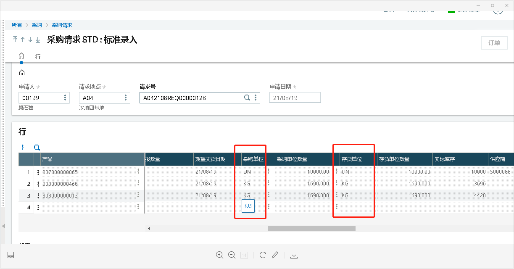
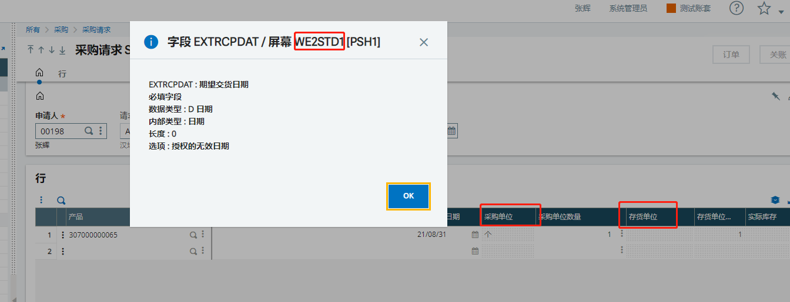
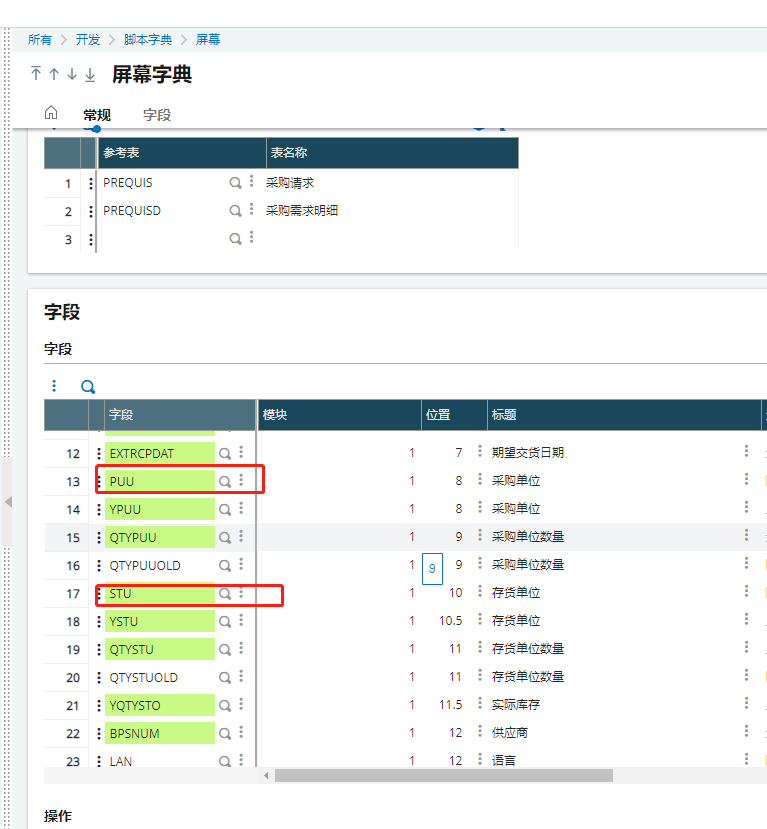
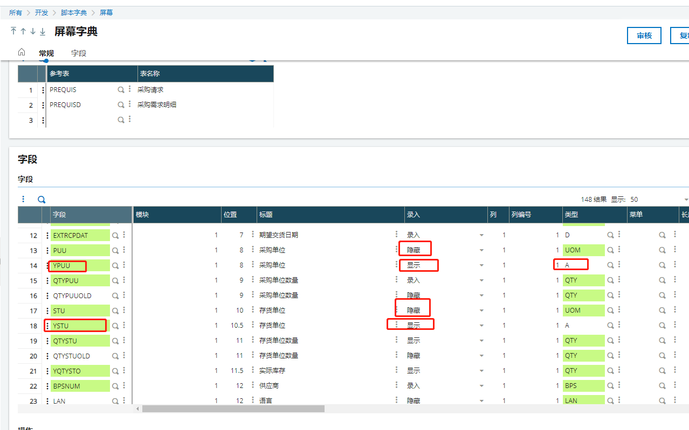

### 采购请求的采购单位和存货单位改成中文

#### 需求列表

1. 采购请求的采购单位和存货单位改成中文
2. 

#### 开发过程

1. 查看屏幕

   

   

2. 找到屏幕内“采购单位”和“存货单位”字段PUU、STU

   

3. 在开发过程中，给这两个字段增加单位转换为中文的代码，发现新建采购请求时报错，单位不能保存，而且之前已经保存的单据，有的单位转换成功，有的单据转换失败（已生成采购订单的数据失败）

4. 新增YPUU、YSTU字段用于显示采购单位、存货单位，字段类型改为A，只用于显示，原始的字段属性保存不变，把原始字段隐藏起来

   

   

5. 给新增的字段增加字段前操作，由于转译单位

6. 编写代码

   ```
   Subprog AV_YPUU(VALEUR)
   Variable Char UNIT
   Variable Char    VALEUR()
   UNIT = [M:PSH1]PUU(NOLIGN-1)
   Call LECTEXTRA(VALEUR,"TABUNIT","DES",UNIT,"") From ATEXTRA
   End
   
   
   Subprog AV_YSTU(VALEUR)
   Variable Char UNIT
   Variable Char    VALEUR()
   UNIT = [M:PSH1]STU(NOLIGN-1)
   Call LECTEXTRA(VALEUR,"TABUNIT","DES",UNIT,"") From ATEXTRA
   End
   End
   ```

7. 编译审核

#### 遇到问题

