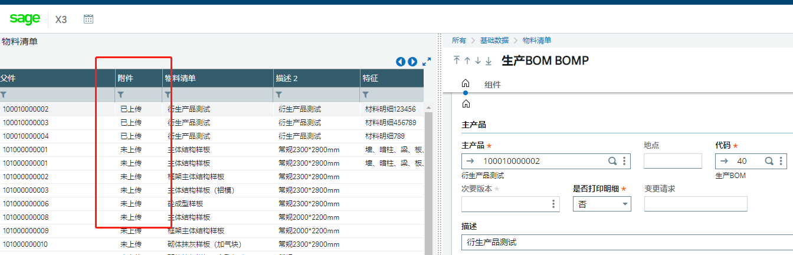
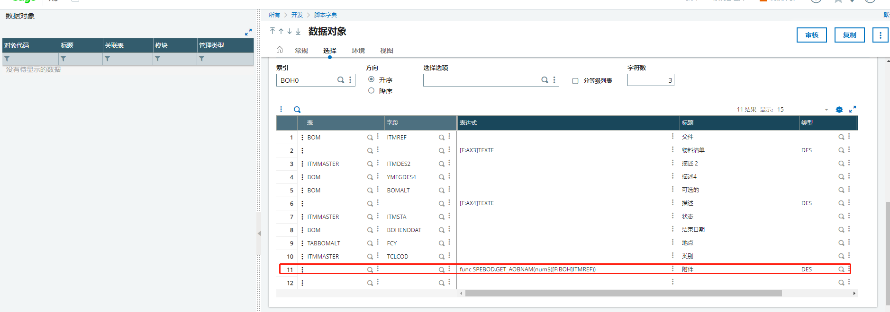

### **开发案例之生产BOM左列表增加附件是否上传功能**

#### 需求列表

1. 左列表根据屏幕内是否上传了附件增加附件是否上传功能
2. 

#### 开发过程：

1. 找到生产BOM的窗体并找到对象

2. 

3. 对象代码BOD，在对象的左列表增加字段，设置表达式func SPEBOD.GET_AOBNAM(num$([F:BOH]ITMREF))

   func 脚本名称.方法名称（参数）

   #SPEBOD 脚本名称

   #GET_AOBNAM	方法名称

   #num$([F:BOH]ITMREF)	参数

   在脚本内写入方法，通过表达式调用脚本内的方法

   需要注意的问题：

   Read [F:AOX]AOX0 = "BOD";"40";PARMS+"~2";"001"

   只能通过索引查找，需要拼接成数据表的索引格式，格式以“；”隔开

   ```
   Funprog GET_AOBNAM(ITMREF)
     #方法名称Funprog
     Local char PARMS(20)
     Local char RESULT(20)
     PARMS = ITMREF#重新复制参数，要不然取不到
     If !clalev ([F:AOX]) :  Local File AOBJTXT[AOX]  : Endif
     Read [F:AOX]AOX0 = "BOD";"40";PARMS+"~2";"001"
     if !fstat
       RESULT = "已上传"
     else
       RESULT = "未上传"
     endif
   END RESULT
   ```

   

   

   

   


