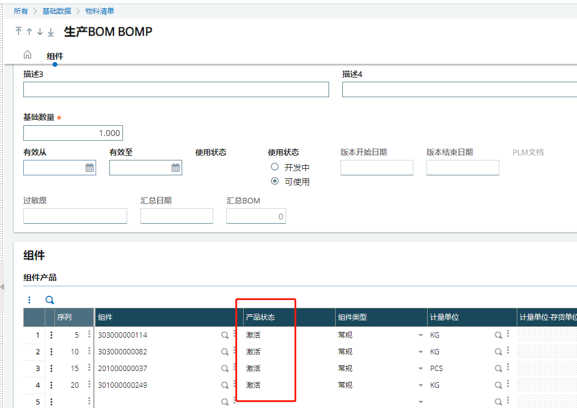
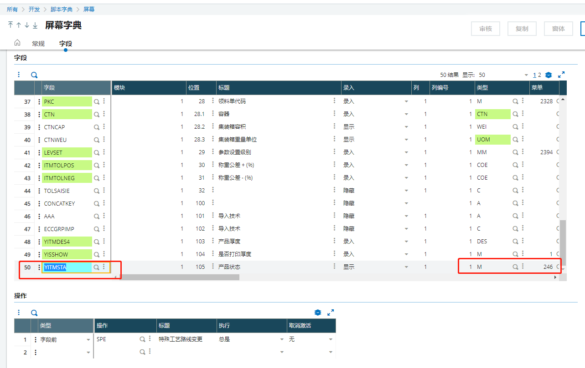

### **开发案例之生产BOM内增加组件增加“产品状态”属性**

#### 需求列表

1. 增加产品状态属性
2. 

#### 开发过程：

1. 找到生产BOM的屏幕

2. 增加字段（要注意字段的类型和菜单数值，具体可查看产品中的“状态”数据类型）

3. 

4. 给字段增加事件（这里添加的是字段前事件）

5. 编写代码

   ```
   ######################################################################################
   ## 由系统管理员添加的标签 (屏幕 BOD1) 2021/10/05 10:08:21 (00198)
   ######################################################################################
   Subprog AV_YITMSTA(VALEUR)
   Variable Integer VALEUR
   If !clalev ([F:ITM]) :  Local File ITMMASTER[ITM]  : Endif
     Read [F:ITM]ITM0 = [M:BOD1]CPNITMREF(nolign-1)
      if !fstat
      VALEUR = [F:ITM]ITMSTA
     else
     endif
   End
   
   ######################################################################################
   ```

   


